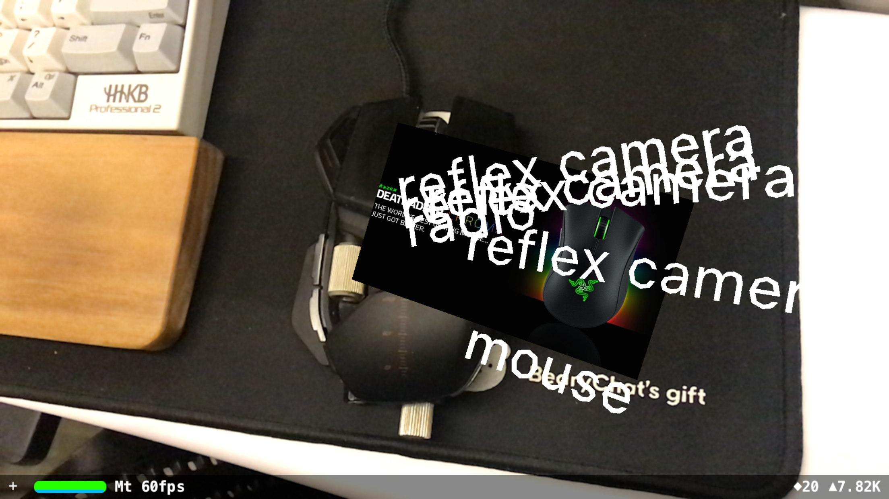

## ARTagger / HomeTag

This is my project for Strikingly 6th Hackathon. I basically want to play around with ARKit and coreML, so the idea came out to combine them.

The app is for tagging stuff on real world, to avoid letting users to input tag manually, a coreML model can automatically recognize stuff for you. But the accuracy is actually depending on the model.

### How to hack

* XCode9 and iOS 11 required. Also the devices you run this app need to be at least iPhone 6S or later.
* Before you start, download an `.mlmodel` [here](https://developer.apple.com/machine-learning/). When `Inception v3` has smaller size and less system resource consuming, `ResNet50` and `VGG16` might give you better result.
* Clone and open the project
* Add the model to your project. (remove my reference in project hierarchy as well)
* Change line 127 of `ViewController.swift` if you're not using `ResNet50`
* Build and run!!

### Other notice

1. **This is a hackathon project, so code quality doesn't represent my real situation  =.=**
2. You can comment out line 95 `addHomeTags(currentFrame: currentFrame)` if you don't like my HomeTag idea. LOL
3. There's very little change I would iterate this again....
4. Do you realize there's a keynote in this repo, that's for my Hackathon demo...

